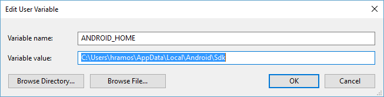

# Sheen Magazine React Native App

## Table of content
* [General Information](#general-information)
* [Project Structure](#project-structure)
* [Important Dependancies](#important-dependancies)
* [Code Convention](#code-convention) 
* [Setup](#setup)

## General Information
Requirements/Scope Doc: https://docs.google.com/document/d/1lomXdubS9TrvM1JnnIQ71or_IGmOy2wAzy0zMXJXCL4/edit?usp=sharing

Figma UI: https://www.figma.com/file/Y1sWAT77RSiDahTe8cBB0O/sheenMagazine_Design?node-id=213%3A1170

Sitemap: https://octopus.do/03wi3hf2q169

## Project Structure
Everything for the functionality of the app is in the App folder. 
* api: all the API call to the backend 
* assets: contains all the logo, pictures and video for the project. 
* components: shared components being used in the project by multiple screens. 
* const: all the constants used in the app besides the styles
* custom-modules: node libraries being customized to fit the need of the application
* features: all the features of the app, MainAppNavigation.tsx is the main application which has all the features in the sub folders inside this folder. Each folder is a tab feature. The index.ts file inside each folder has the navigation to each screen in the folder. Each screen is a file inside the folder. 
* navigation: all the screens navigations in each feature
* redux: the store setup for the app 
* styles: all the styles being shared between multiple component 
* types: user defined types for the app 
* utilities: all the helper and extra function needed for the app 

## Important Dependancies
* babel-plugin-module-resolver: make sure the import is used with alias so the start of the import for the components inside the App folder will start from the App folder. 
* react-native-tailwindcss: this is the predefined stylesheets for the project. It contains all the commonly used styles. 
Documentation: https://tvke.github.io/react-native-tailwindcss/
* react-native-vector-icons: Contains most of the icons needed for the project. <br />
Documentation: https://github.com/oblador/react-native-vector-icons <br />
Icon Directory: https://oblador.github.io/react-native-vector-icons/
* @react-navigation/native-stack: Navigation for most of the features. 
* react-hook-form: provides features to implement form interfaces and handle form submission <br />
Documentation: https://react-hook-form.com/ <br />
Sample Demo: https://react-hook-form.com/get-started#ReactNative <br />
A form control includes:
    - Controller: input component with properties like value, type, validation
        - Mandatory properties:
        - control: this is to register controller into React Hook Form.
        - name: input control name. This needs to be unique.
        - rules: this is to validate input on typing. First, all rules are set up in App/utilities/rules.ts). After that, these rules are pd to controller.
        - render: this is to render input control with values, event methods and other properties.
    - Error Message: customized component to display error when input value does not pass validation check
    - Form submission: to handle form submission, use handleSubmit function and pass an action event.
    
Utilities support: 
* lodash: contains all the necessaries utilities actions. 
Documentation: https://lodash.com/
* moment: the utilities using for date and time of the app. 
Documentation: https://momentjs.com/

## Code convention 
* For the features folder, everything which is the screen for a feature will be in the corresponding folder. All supporting components are going to be placed in components folder. 
* To add new feature, look for the navigation folder and add the new screen in the corresponding feature 
* Styling for screens and component will be minimized to the CSS library as much as possible to avoid long code file 
* Code file will try to have maximum length to be 250 lines to be easy to track 
* Project uses the babel-plugin-module-resolver to make sure the import is consistent for all files. All import path for file inside the App folder should start at the App folder rather than using relative path.  
* Naming for component should start with the noun of the action it does and the description. For example: for a list to display many articles, use "ListArticles" instead of "ArticleList". This way we can group all the components and variables with similar functionality together. 
* One component in 1 file only - put all components related to a feature inside the components folder inside that feature folder. 
* Make sure to write to the docs folder the components you have worked on. 

## Setup

### Android
The project uses TypeScript to get Typing support. 
Set up environment: https://reactnative.dev/docs/environment-setup
1. Node JS and JDK: 
You will need Node, the React Native command line interface, a JDK, and Android Studio.
We recommend installing Node via Chocolatey, a popular package manager for Windows.
Open an Administrator Command Prompt (right click Command Prompt and select "Run as Administrator"), then run the following command:
```
choco install -y nodejs-lts openjdk11
```
2. Install Android Studio
3. Configure the ANDROID_HOME environment variable

* Open the Windows Control Panel.
* Click on User Accounts, then click User Accounts again
* Click on Change my environment variables
* Click on New... to create a new ANDROID_HOME user variable that points to the path to your Android SDK:


4. Add platform-tools to Path
* Open the Windows Control Panel.
* Click on User Accounts, then click User Accounts again
* Click on Change my environment variables
* Select the Path variable.
* Click Edit.
* Click New and add the path to platform-tools to the list.

The default location for this folder is:
```
%LOCALAPPDATA%\Android\Sdk\platform-tools
```
5. Clone the application and run  
```
npm install 
```

### IOS

1. Node JS and IOS SDK: 
You will need Node, the React Native command line interface and Xcode.
2. Install Xcode
3. Configure Xcode emulator
4. Install nvm on your machine. ()[]
5. Clone the application and run:
```
nvm use
nvm install <whatever version is in .nvmrc>
npm install
```
6. if you run into any issue installing pods run:

```
sudo gem install cocoapods --pre
npx pod-install
```

# For information about the front end and back end development of the app, check the docs folder