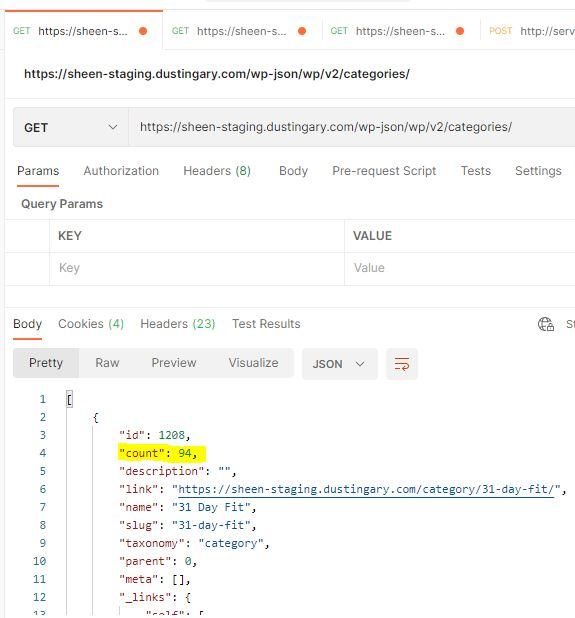
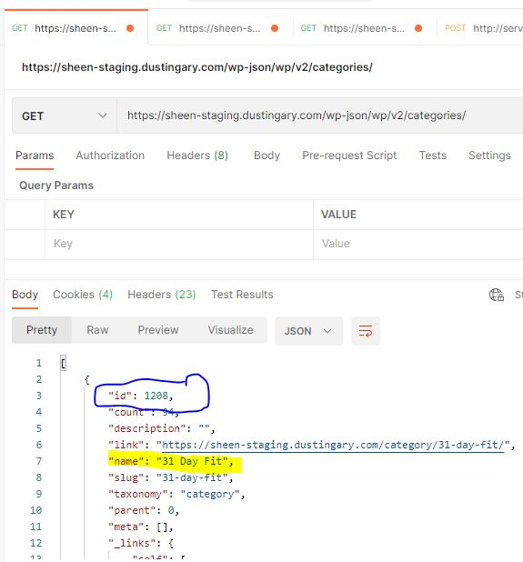
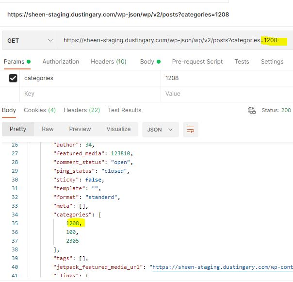

# API Descriptions 

## Table of contents
* [Categories List](#categories-list) 
* [List Posts](#list-posts)
* [Retrieve A Post](#retrieve-a-post)
* [List Tags By Ids](#list-tags-by-ids)
* [List Post Comments](#list-post-comments)
* [Comment in an post](#comment-in-an-post) 


## Categories List
* Get all the categories for all the blog posts.
* Method: GET 
* URL: https://sheen-staging.dustingary.com/wp-json/wp/v2/categories/
* Params: 
    * page: Current page of the collection. <br />
    Default: 1
    * per_page: Maximum number of items to be returned in result set. <br />
    Default: 10 
* We are currently having about 45 different categories in the page for all the blog post. Potentially we will need to call this again and again to grab all the categories. 
* Each category will have a count attribute to show how many blog posts are in the that category. 




## List Posts
* Get the blog post with filtering params 
* Method: GET 
* URL: https://sheen-staging.dustingary.com/wp-json/wp/v2/posts 
* Params: 
    * page: Current page of the collection. <br />
    Default: 1
    * per_page: Maximum number of items to be returned in result set. <br />
    Default: 10 
    * categories: Limit result set to all items that have the specified term assigned in the categories taxonomy. <br />
    This is optional but needed when filter by the category when calling API. 
* Data to get from category when doing filter: category id with the corresponding name<br />
    
* Apply the filter with the category to get the blog posts <br />
    


## Retrieve A Post
* Get information about 1 particular post only
* Method: GET 
* URL: https://sheen-staging.dustingary.com/wp-json/wp/v2/posts/{id}
    * {id}: Unique identifier for the object. 

## List Tags By Ids
* Get all the tags by matching a list of ids
* Method: GET 
* URL: https://sheen-staging.dustingary.com/wp-json/wp/v2/tags
* Params: 
    * include: list of tag id separated by a comma
* Example query: https://sheen-staging.dustingary.com/wp-json/wp/v2/tags?include=19809,22281,22811,1625
* Example response: 
```
[
    {
        "id": 19809,
        "count": 325,
        "description": "",
        "link": "https://sheen-staging.dustingary.com/tag/2022/",
        "name": "2022",
        "slug": "2022",
        "taxonomy": "post_tag",
        "meta": [],
        "_links": {
            "self": [
                {
                    "href": "https://sheen-staging.dustingary.com/wp-json/wp/v2/tags/19809"
                }
            ],
            "collection": [
                {
                    "href": "https://sheen-staging.dustingary.com/wp-json/wp/v2/tags"
                }
            ],
            "about": [
                {
                    "href": "https://sheen-staging.dustingary.com/wp-json/wp/v2/taxonomies/post_tag"
                }
            ],
            "wp:post_type": [
                {
                    "href": "https://sheen-staging.dustingary.com/wp-json/wp/v2/posts?tags=19809"
                }
            ],
            "curies": [
                {
                    "name": "wp",
                    "href": "https://api.w.org/{rel}",
                    "templated": true
                }
            ]
        }
    },
    {
        "id": 22281,
        "count": 11,
        "description": "",
        "link": "https://sheen-staging.dustingary.com/tag/jessica-nash/",
        "name": "jessica nash",
        "slug": "jessica-nash",
        "taxonomy": "post_tag",
        "meta": [],
        "_links": {
            "self": [
                {
                    "href": "https://sheen-staging.dustingary.com/wp-json/wp/v2/tags/22281"
                }
            ],
            "collection": [
                {
                    "href": "https://sheen-staging.dustingary.com/wp-json/wp/v2/tags"
                }
            ],
            "about": [
                {
                    "href": "https://sheen-staging.dustingary.com/wp-json/wp/v2/taxonomies/post_tag"
                }
            ],
            "wp:post_type": [
                {
                    "href": "https://sheen-staging.dustingary.com/wp-json/wp/v2/posts?tags=22281"
                }
            ],
            "curies": [
                {
                    "name": "wp",
                    "href": "https://api.w.org/{rel}",
                    "templated": true
                }
            ]
        }
    }
]
```

## List Post Comments
* Get all the comments in a blog posts.
* Method: GET 
* URL: https://sheen-staging.dustingary.com/wp-json/wp/v2/comments
* Params: 
    * post: Post Id to used. Need to get the post ID from the post to get the right comments 
    * page: Current page of the collection. <br />
    Default: 1
    * per_page: Maximum number of items to be returned in result set. <br />
    Default: 10 


## Comment in an post
* Make a comment in a blog post 
* Method: POST 
* URL: https://sheen-staging.dustingary.com/wp-json/wp/v2/comments
* Data: attributes in bold are required
    * author_email: Email address for the object author.
    * author_name: Display name for the object author.
    * author_url: URL for the object author. Optional to go to the author website 
    * <b>content</b>: The content for the object. 
    * <b>date</b>: The date the object was published, in the site's timezone.
    * <b>post</b>: The ID of the associated post object.
